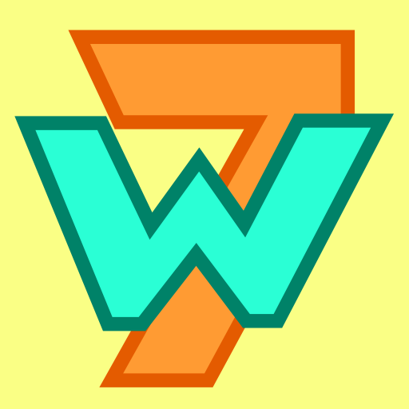

7 Words
=======

A simple word game written in 2015 targeting Android phones. The game was written in Python using the [Kivy UI](https://www.kivy.org) framework. It features integration with Google Play achievements and leaderboard. I got sick of keeping up with the everchanging requirements of the Play Store and converted the [code to JavaScript](https://github.com/spillz/7words-js) using an experimental lite-weight clone of the core bits of Kivy in a lib called ESKV. 

